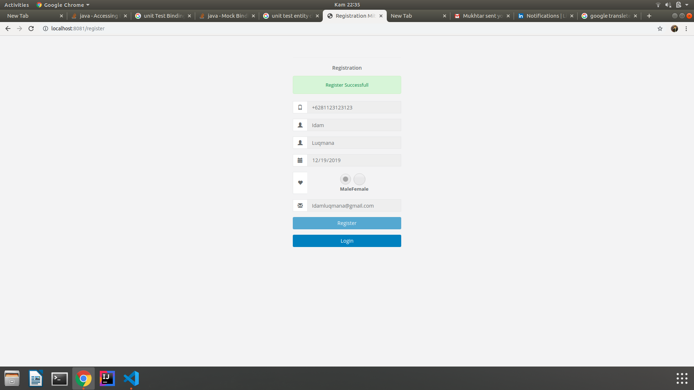
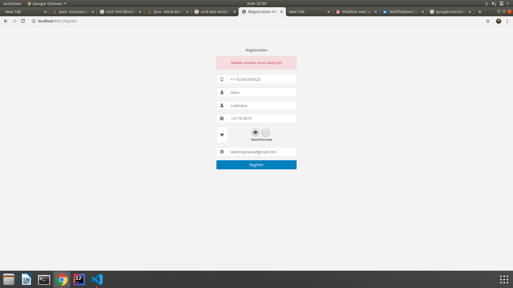
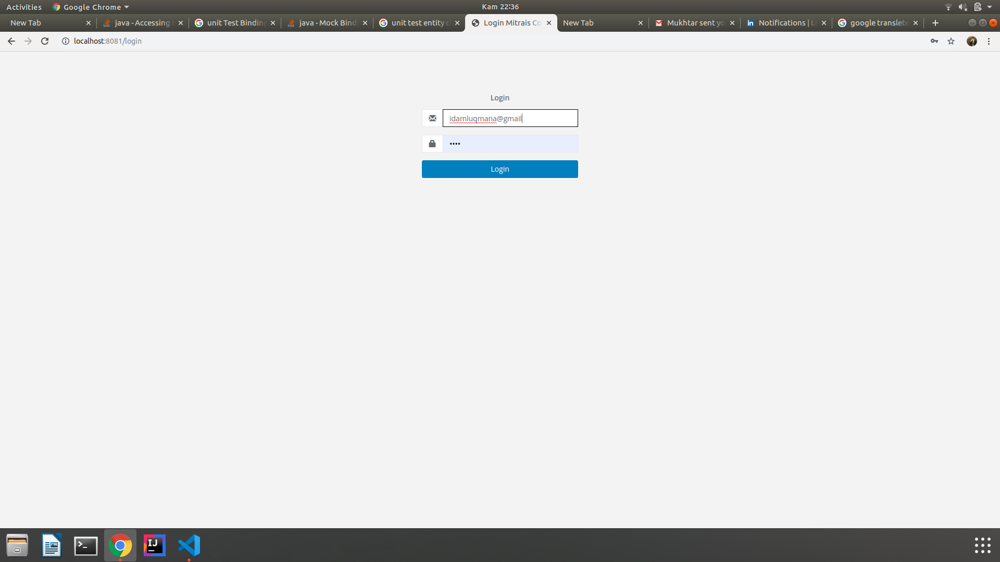

# Coding test Mitrais Simple Registration

Simple Registration is a java spring boot project that used by Mitrais to know my knowledge about Web Technologies. in this project i use library spring boot , with JPA for ORM and Thymeleaf for UI.

## Getting Started


### Prerequisites

What things you need to install the software and how to install them

You need intall :
- Java 8
- Apache Maven
- SQL Server
- Visual Studio Code or another IDE platforms

### Installing

A step to run this project you must :

setting application.properties for change the connection properties that you use for run the project. i use SQLSERVER so this setting

```
spring.datasource.url=jdbc:sqlserver://localhost:1433;databaseName=codingtest
spring.datasource.username=SA
spring.datasource.password=M4nchuni4n
spring.datasource.driver-class-name=com.microsoft.sqlserver.jdbc.SQLServerDriver
spring.jpa.properties.hibernate.dialect = org.hibernate.dialect.SQLServer2012Dialect
```
go to terminal in project directory and run with command :
```
mvn clean install spring-boot:run
```

End with an example of getting some data out of the system or using it for a little demo

if register submited successfull



and if register property not proper



login page



## Running the tests

How to run the unit tests for this system

```
mvn test
```

if you have sonarqube for see the coverage test u can use command 

```
mvn clean org.jacoco:jacoco-maven-plugin:prepare-agent -Dmaven.test.failure.ignore=false package sonar:sonar -Dsonar.host.url=http://{host}:{port}
```

## Built With

* [Spring Boot](https://start.spring.io/) - The Spring framework used
* [Maven Depedency](https://maven.apache.org/) - Dependency Management


## Authors

* **Idam Luqmana** - [LinkedIn](https://www.linkedin.cn/in/idam-luqmana-5b8088119/)

.

